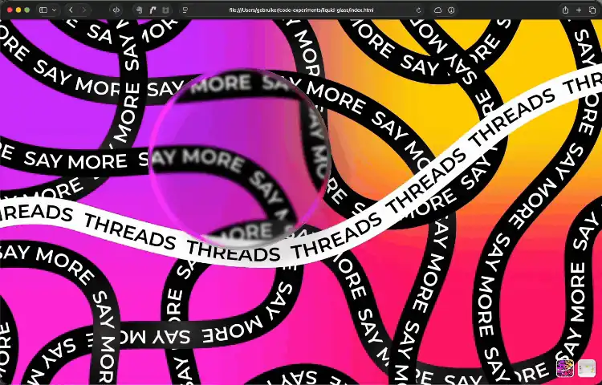

# Liquid Glass CSS

A proof-of-concept **faux refraction effect** for the web — Apple-style "Liquid Glass" rendered with nothing but stacked `<div>`s and `backdrop-filter`. **No SVG filters, no canvas, no WebGL** — and it works across all modern browsers that support `backdrop-filter`.

## Demo

**Live demo:** [waldbach.github.io/liquid-glass-css](https://waldbach.github.io/liquid-glass-css/)



Drag the glass disc across the background to see the effect. A switcher in the bottom-right corner lets you swap between two background images.

## How it works

The illusion of refraction is built from a stack of concentric circular layers. Each layer is masked to a thin ring using a `radial-gradient` mask, and each ring applies a slightly different `backdrop-filter` — varying the blur radius and saturation across the stack. The result reads as light bending through the edge of a glass disc, even though no actual refraction is being calculated.

```
outermost ring → heavy blur, high saturation
       ...    → blur tapers down toward the center
center        → minimal blur, near-clear
```

> **Note on saturation:** the high `saturate()` values across the rings are deliberately exaggerated to make the refraction effect more visible in the demo. Feel free to tone them down — or remove them entirely — to suit your own taste. The blur stack alone is enough to sell the effect; the saturation is just seasoning.

## Run it

Just open `index.html` in a browser. No build step, no dependencies to install. jQuery and jQuery UI are loaded from a CDN purely to make the disc draggable for the demo.

## Status: proof of concept

This is intentionally a **rough first cut** to prove the technique works. There is plenty of room to refine it:

- **The 16 stacked layers are hand-written in HTML/CSS.** A future version should generate them with JavaScript so you can pass in a single config object — radius, layer count, blur range, saturation range, mask falloff — and have the markup and styles built dynamically.
- **Expose the effect as CSS variables** so the look can be fine-tuned without touching the layer math.
- **Drop the jQuery dependency** in favor of vanilla JS for the drag interaction.
- **Tune for performance** — 16 stacked `backdrop-filter` layers is heavy. The right balance of layer count vs. visual fidelity is worth exploring.
- **Edge cases** — behavior on non-circular shapes, smaller sizes, and over high-frequency backgrounds hasn't been explored yet.
- **Mobile** — the technique should work on mobile browsers, but it hasn't been tested there yet. The "drag" hint is desktop-only for now.

## Browser support

Anything with `backdrop-filter` support, which today is essentially every current browser. No vendor-specific filters or SVG `<feDisplacementMap>` involved, which is what historically made this kind of effect a Safari-only or filter-graph-only trick.

## Future explorations

I might try to take the effect further, with more layers, but that can become rather expensive in terms of compute. Also, `mask-image` can have an image (eg. SVG) as well, which I may explore soon. Different shapes can have this effect it this works out. Also thinking of creating a demo with parameters UI, so you can play with the settings.

## Image credits

- `img/threads.webp` — sourced from [Freepik]([https://www.freepik.com/](https://www.freepik.com/free-vector/gradient-logo-template-new-threads-social-media-application_63087147.htm) (premium account).
- `img/vases.webp` — photo by [Natalie Kinnear]([https://unsplash.com/](https://unsplash.com/photos/three-vases-with-flowers-in-them-on-a-white-background--VRIZVaSXH8) on Unsplash.

## License

MIT — see [LICENSE](LICENSE).

Built by [Janne Wolterbeek](https://waldbach.studio/) / Studio Waldbach.
